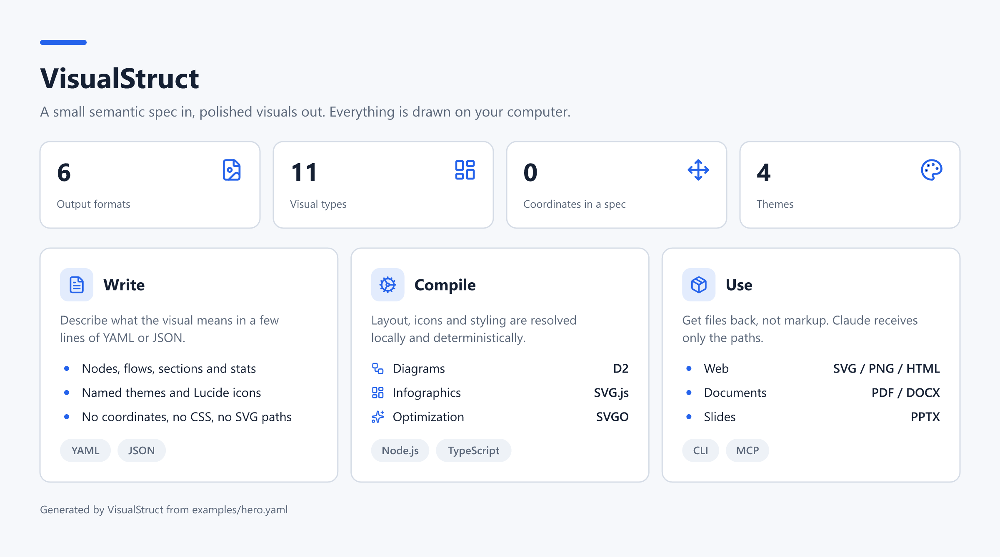

<p align="center">
  
</p>

# VisualStruct

**A small semantic spec in, polished SVG, PNG and HTML visuals out, compiled on your own computer.**

[](https://github.com/KelesogluMustafa/visualstruct/releases/latest)
[](https://github.com/KelesogluMustafa/visualstruct/actions/workflows/ci.yml)
[](LICENSE)

**[Download for Windows](https://github.com/KelesogluMustafa/visualstruct/releases/latest)** ·
**[Quick Start](#quick-start)** ·
**[Integrations](docs/INTEGRATIONS.md)** ·
**[Changelog](CHANGELOG.md)**

## What is it?

VisualStruct is a local visual compiler. You, or an AI assistant such as Claude, write a short
`VisualSpec` in YAML or JSON that says what the visual means: nodes, flows, sections, stats.
VisualStruct does the layout, icons, styling and export, and writes SVG, PNG and HTML files,
plus PDF, PPTX and DOCX on request. The image above was generated from
[examples/hero.yaml](examples/hero.yaml).

## Why use it?

- **Token-efficient.** The assistant writes a compact spec, never SVG paths, coordinates or
  CSS, and gets file paths back, not markup.
- **Consistent.** The same spec always gives the same visual, in one of four themes.
- **Local.** Rendering happens on your machine. No account, no upload.
- **Reusable output.** One master SVG is exported to every format you ask for.

It is for developers and technical writers who want architecture diagrams, flows, comparisons,
timelines and infographics from text, and for Claude Code, Claude Desktop and ChatGPT users
who want an assistant to produce them without spending tokens on markup.

## Quick Start

On Windows, with [Node.js 22+](https://nodejs.org/) installed:

1. Download `VisualStruct-Windows-Setup-0.3.4.zip` from the
   [latest release](https://github.com/KelesogluMustafa/visualstruct/releases/latest) and extract it.
2. Double-click `install.cmd`.
3. Open a new terminal, save the spec below as `overview.yaml` and render it:

```yaml
v: 1
type: comparison
title: Output formats
columns:
  - { title: SVG, icon: file-code }
  - { title: PNG, icon: file-image }
rows:
  - [Best for, Web and docs, Chat and slides]
  - [Scales without blur, true, false]
```

```
visualstruct render overview.yaml
```

This writes `output/overview.svg`, `.png` and `.html` and prints the file paths.

## Installation

| Platform | Status | How |
|---|---|---|
| Windows 10/11 | Supported and tested | Setup ZIP from the latest release, see below |
| Linux | Automated tests run on Ubuntu. No installer; manual use is not tested | From source, see below |
| macOS | Not tested | From source, see below |

### Windows

Requirements: Node.js 22 or newer and an internet connection during installation (npm downloads
the dependencies). The diagram types (`architecture`, `flow`, `system-map`, `data-flow`,
`sequence`) also need [D2](https://d2lang.com): `winget install Terrastruct.D2`. Infographics,
comparisons, timelines and the other types work without it.

`install.cmd` installs the command line. Add a mode for the integrations:

| Command | Installs |
|---|---|
| `install.cmd` | Command line |
| `install.cmd desktop` | Command line + the Claude Desktop files in the Setup folder |
| `install.cmd code` | Command line + Claude Code plugin (needs the `claude` CLI and git) |
| `install.cmd both` | All of the above |

VisualStruct is installed to `%USERPROFILE%\.local\visualstruct\v<version>` and the
`visualstruct` command to `%USERPROFILE%\.local\bin`, which is added to your user PATH.
Re-running the installer is safe.

**Uninstall:** delete `%USERPROFILE%\.local\visualstruct` and
`%USERPROFILE%\.local\bin\visualstruct.cmd`.

### From source (any platform)

```bash
git clone https://github.com/KelesogluMustafa/visualstruct.git
cd visualstruct
npm ci
npm run doctor
npm run render -- examples/infographic.yaml
```

On Windows, `.\install.ps1 -Mode both` installs from the checkout in the same way as the Setup ZIP.

## Usage

```
visualstruct validate overview.yaml
visualstruct render overview.yaml
visualstruct render overview.yaml --format svg,png --theme technical-dark --out ./output
visualstruct render overview.yaml --format all
visualstruct doctor
```

| Format | What you get |
|---|---|
| `svg`, `png`, `html` | The default set: optimized SVG, 2x PNG, standalone responsive page |
| `pdf` | Single-page vector PDF sized to the visual. Text is outlined, so it is not selectable |
| `pptx` | One 16:9 slide with the visual centered, embedded as PNG |
| `docx` | A4 page with title, optional subtitle and the visual as PNG |

## VisualSpec

No coordinates, no raw SVG, no CSS. Unknown keys are rejected.

```yaml
v: 1
type: architecture
title: SaveFold
nodes:
  web: { label: Web, tech: Vite, icon: monitor }
  api: { label: API, tech: Node.js, icon: server }
  db: { label: Database, tech: MySQL, icon: database }
flow:
  - web>api>db
```

| Engine | Types | Main fields |
|---|---|---|
| D2 | `architecture`, `flow`, `system-map`, `data-flow`, `sequence` | `nodes`, `groups`, `flow`, `direction` |
| SVG.js | `infographic`, `project-overview`, `stack`, `timeline`, `roadmap` | `stats`, `sections` (`items`, `tags`), `cols` |
| SVG.js | `comparison` | `columns`, `rows` (`[label, value, ...]`) |

Common fields: `title`, `subtitle`, `footer`, `theme`, `responsive`, `output: { formats, dir, name }`.
Themes: `technical-light` (default), `technical-dark`, `minimal-light`, `portfolio`.
Icons are [Lucide](https://lucide.dev/icons) names. More specs: [examples/](examples).

## Integrations

VisualStruct serves one MCP tool, `visual_render`, which takes a spec and returns file paths and
warnings only. Each integration is a thin launcher for the installed runtime.

| Surface | Install |
|---|---|
| Claude Code | `install.cmd code`, or the plugin marketplace `KelesogluMustafa/visualstruct` |
| Claude Desktop | `visualstruct-0.3.4.mcpb` and `visualstruct-skill.zip` |
| ChatGPT and Codex Desktop | `visualstruct-chatgpt-plugin.zip` |

Step-by-step setup and manual MCP registration: [Integrations](docs/INTEGRATIONS.md).

## Documentation

- [Integrations](docs/INTEGRATIONS.md): Claude Code, Claude Desktop, ChatGPT and Codex
- [Architecture](VISUALSTRUCT_MASTER_ARCHITECTURE.md): design and scope
- [Changelog](CHANGELOG.md)

## Project Status

Version 0.3.4, early release. Developed and tested on Windows 11. Automated tests run on
Windows and Ubuntu.

## Development

```bash
npm test
npm run typecheck
npm run build
npm run release:pack
```

## License

[MIT](LICENSE)

## Support / Issues

Report problems in [Issues](https://github.com/KelesogluMustafa/visualstruct/issues); the spec
that fails helps.
